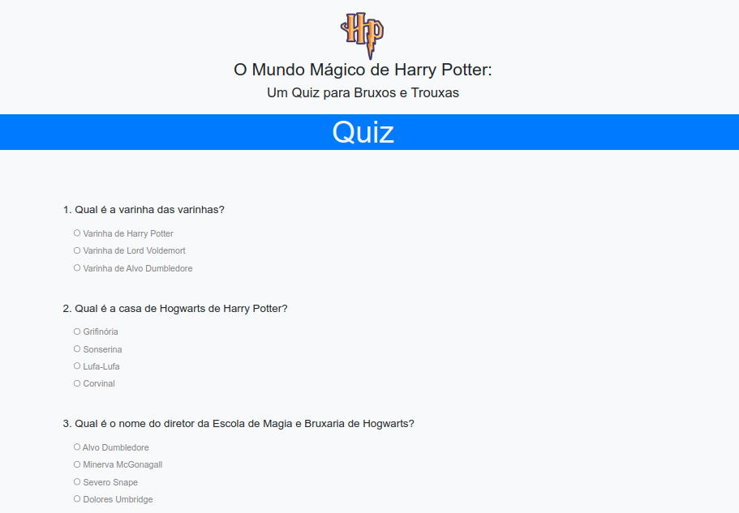

# Quiz Interativo - CJRM

#### Tela da aplicação



Esta aplicação `Quiz`faz parte grade de estudos do curso: 

```javascript
CJRM {
    curso: 'CJRM - Curso Javascript Roger Melo'
    professor: 'Roger Melo'
}
```

As habilidades dessa aplicação envolvem tratamentos de eventos em formulários, verificações condicionais na comparação de respostas escolhidas no form da aplicação fornecidas nas escolhas pelo usuário e apresentação do resultado do total das respostas do `Quiz`ao usuário.

# 

> Author: Pedro Henrique
> 
> [contato: ](mailto:dev.pedro.rjas@gmail.com)
> 
> [whatsapp:](https://wa.me/5519994513631)